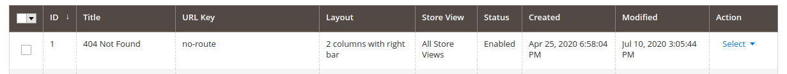
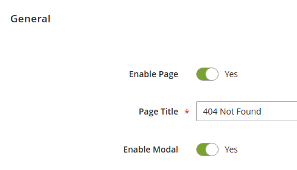
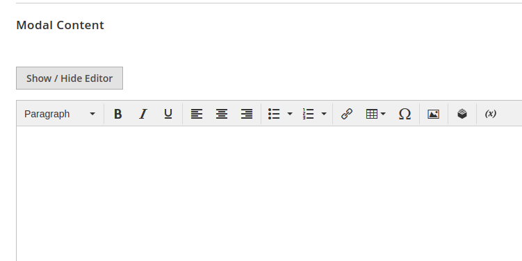

# Magento 2 CMS Modals

    ``jmc/module-cmsmodals``

 - [Main Functionalities](#markdown-header-main-functionalities)
 - [Installation](#markdown-header-installation)
 - [Demo](#markdown-header-demo)

## Main Functionalities
This module allows you to add a modal to any cms page and edit the content of it from the content manager of the Magento Cms Pages.

## Installation
\* = in production please use the `--keep-generated` option

### Type 1: Zip file

 - Unzip the zip file in `app/code/JMC`
 - Enable the module by running `php bin/magento module:enable JMC_CmsModals`
 - Apply database updates by running `php bin/magento setup:upgrade`\*
 - Flush the cache by running `php bin/magento cache:flush`

## Demo

1. Choose the Cms Page that will contain the modal

2. Enable modal on that Cms Page

3. Edit the content of the modal

4. Save your Cms Page
